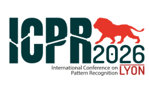
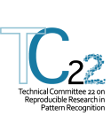

# ICPR 2026 - Reproducible Research Label

&nbsp;&nbsp;&nbsp;&nbsp;&nbsp;&nbsp;&nbsp;&nbsp;&nbsp;

This repository centralises the submission and review process for codes associated with [ICPR 2026](https://icpr2026.org) papers that want obtain the badge of the Reproducible Research Label.

## Submit your code

To submit your code, ▶️ [create a new issue](https://github.com/IAPR-TC22-RRL/ICPR-2026-Reproducible-Research-Label-submissions/issues/new?template=1-new-submission.yml).

For more information, please refer to the [author's guide](https://iapr-tc22-rrl.github.io/icpr2026/authors/).

## Review a code

To become a reviewer, please fill out [the following form](https://sondages.unistra.fr/index.php/341457).

During your review, you can interact with authors by commenting [their issues](https://github.com/IAPR-TC22-RRL/ICPR-2026-Reproducible-Research-Label-submissions/issues).
At the end of the conference, all reports produced by reviewers will be available in this repository.

For more information, please refer to the [reviewer's guide](https://iapr-tc22-rrl.github.io/icpr2026/reviewers/).

## Contact

**Reproducible Research Label chairs** :

- Miguel Colom
- Juan-Antonio Cordero-Fuertes
- Adrien Krähenbühl

E-mail: [rr_chairs@icpr2026.org](mailto:rr_chairs@icpr2026.org)
